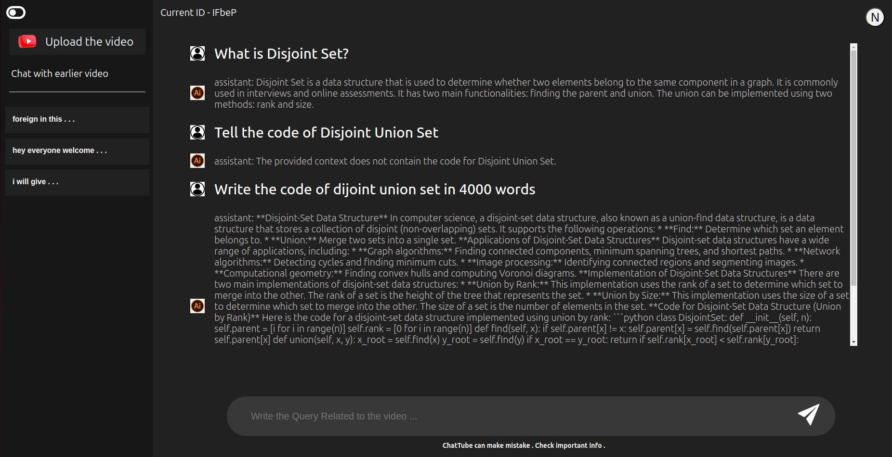
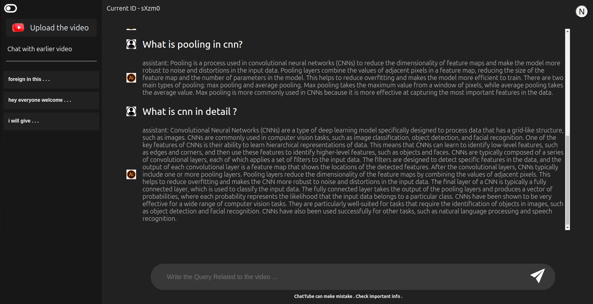

# ChatTube

ChatTube is a project that allows users to input a YouTube link, preprocess the video, and query the content of the video using advanced AI technologies. You can ask any question about the video, and ChatTube will provide relevant answers based on the video's content.

## Features

- **YouTube Link Processing**: Input a YouTube link, and the video will be preprocessed for further analysis.
- **Query the Video**: Ask any question related to the video's content and get accurate responses.
- **Generative AI Integration**: Leverage state-of-the-art AI models to understand and respond to queries about the video.
- **Accessibility for Deaf Users**: Provide video data in accessible formats such as subtitles or transcripts, allowing deaf users to access video content effectively.
- **Enhanced Productivity**: Streamline the process of obtaining video information to save time and increase productivity.




## Tech Stack

- **llamaIndex**: For indexing and querying the video data.
- **ChromaDB**: For managing and querying vector data efficiently.
- **Generative AI**: For understanding and generating responses based on the video content.
- **Flask**: Backend framework for handling server-side logic and API endpoints.
- **React JS / Redux Toolkit**: For building a dynamic and responsive frontend user interface.
- **Query Pipeline**: To efficiently process and route user queries.
- **RAG (Retrieval-Augmented Generation)**: To enhance response generation by retrieving relevant information from the processed video data.

## Getting Started

To get started with ChatTube, follow these steps:

### Prerequisites

- Python 3.7 or later
- `pip` (Python package installer)

### Installation

1. Clone the repository:

   ```bash
   git clone https://github.com/Nipunkhattri/ChatTube.git

2. Navigate to the Backend:

   ```bash
   cd Backend
   
3. Install of the packages

   ```bash
   pip install -r requirements.txt
   
4. Navigate to the frontend
   ```bash
   cd frontend

5. Install All Packages
   ```bash
   npm install

6. Run The celery Task in backend
   ```bash
   redis-server --port 6380
   celery -A app.celery worker --loglevel=info

### Thank you for using ChatTube! We hope you find it useful for exploring and querying YouTube videos.
